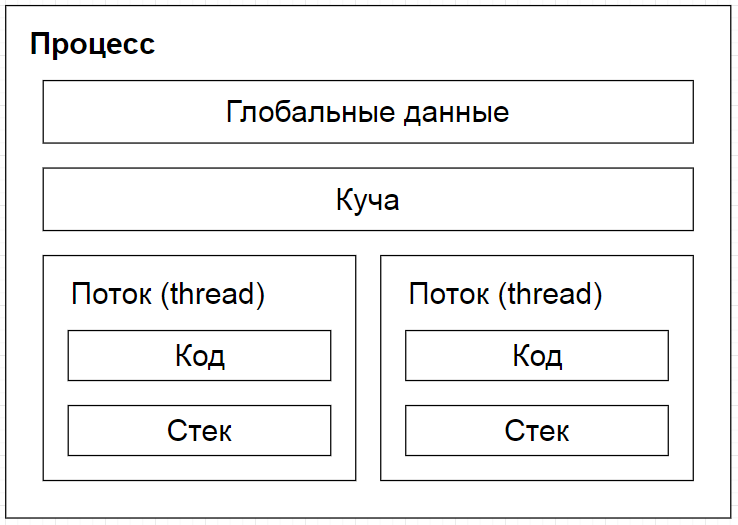
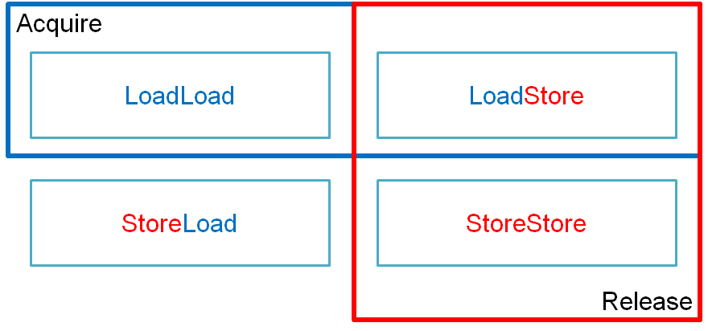
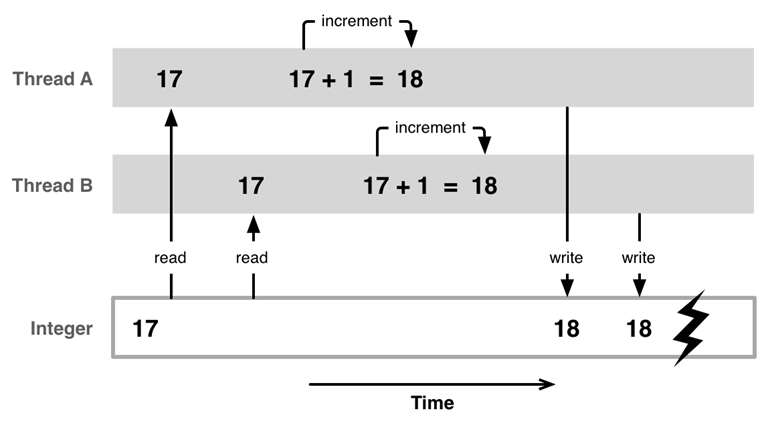
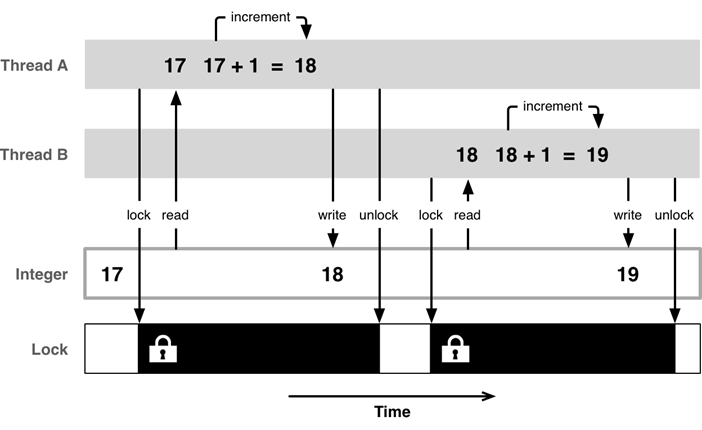
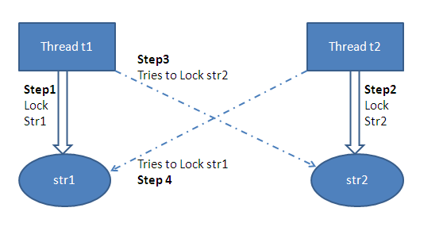

### std::function

Обёртка функции общего назначения. Экземпляры std::function могут хранить и ссылаться на любой вызываемый объект - функцию, лямбда-выражение, привязку выражения или другой объект-функцию. Экземпляры std::function можно хранить в переменных, контейнерах, передавать в функции.

```c++
#include <functional>

using Function = std::function<void (int)>;

void doSomething(Function f)
{
    f(10);
}

void foo(int x) {}

Function f1 = foo;
Function f2 = [](int x) {};

struct A
{
    void operator()(int x) {}
};

Function f3 = A();

struct B
{
    void bar(int x) {}
    static void foo(int x) {}
};

Function f4 = &B::foo;

B b;
Function f5 = std::bind(
    &B::bar, &b, std::placeholders::_1);

std::vector<Function> functions = 
    { f1, f2, f3, f4, f5 };
for (auto& f : functions)
    doSomething(f);
```

#### std::bind

Позволяет получить функциональный объект с требуемым интерфейсом.

```c++
using Generator = std::function<int ()>;

void prepareData(Generator gen) { ... }

int monotonic(int initial) { ... }
int random(const std::string& device) { ... }

Generator gen1 = std::bind(monotonic, 100);
prepareData(gen1);

Generator gen2 = std::bind(random, "/dev/random");
prepareData(gen2);
```

```c++
if (std::all_of(v.begin(), v.end(), 
    [](int x) { return x < 5; }))
{
    ...
}

bool lessThan(int v, int max)
{
    return v < max;
}

auto lessThan3 = 
    std::bind(lessThan, std::placeholders::_1, 3);
if (std::all_of(v.begin(), v.end(), lessThan3))
{
    ...
}
```

```c++
struct Robot
{
    Robot() = default;
    Robot(const Robot&) = delete;
    Robot& operator=(const Robot&) = delete;
};

using Command = std::function<void ()>;

enum class Direction
{
    Left,
    Right,
    Up,
    Down
};

void move(Robot& robot, Direction dir) { ... }
void fire(Robot& robot) { ... }

Robot robot;

std::vector<Command> program;

program.push_back(
    std::bind(move, robot, Direction::Left)); // error
program.push_back(
    std::bind(fire, robot)); // error
```

```c++
program.push_back(
    std::bind(move, std::ref(robot), Direction::Left));
program.push_back(
    std::bind(fire, std::ref(robot)));
```

### Многопоточность (multithreading)



Многозадачность – возможность параллельной (или псевдопараллельной) обработки нескольких задач.

1. Многозадачность основанная на прерываниях планировщика
2. Кооперативная многозадачность – выполняемый код должен уступать процессорное время для других

#### Современные компьютеры – сложные системы

#### Компилятор

С++ почти ничего не знает о многопоточности и при оптимизизациях не учитывает фактор многопоточности.

```c++
bool shutdown = false;

void thread1()
{
    shutdown = false;
    while (!shutdown) 
    {
        // Может выполняться вечно
    }
}

void thread2()
{
    shutdown = true;
}
```

```c++
volatile bool shutdown = false;
// Поможет лишь частично!
```

#### Процессор


```c++
bool ready = false;
int data = 0;

int foo() { return 5; }

void produce()
{
    data = foo();
    ready = true;
}

void consume()
{
    while (!ready) ;
    assert(data == 5); // не всегда
}
```

Вожможный пример выполнения кода процессором:

```c++
void produce()
{
    // data = foo();
    // Это долго, выполню пока это:
    ready = true;
    // А теперь остальное:
    data = foo();
}

void consume()
{
    while (!ready) // ждем
        ;
    assert(data == 5); // не всегда
}
```

Исправляем produce:

```c++
void produce()
{
    data = foo();
    // Инструкция запрещающая процессору
    // изменять порядок выполнения
    ------------------
    ready = true;
}

void consume()
{
    // Этих данных у меня еще нет
    // while (!ready)
    //    ;
    // Поэтому, поскольку данные не
    // взаимосвязаны, можно выполнить
    assert(data == 5); // не всегда
    // А теперь
    while (!ready) // ждем
        ;
}
```

Исправляем consume:

```c++
void consume()
{
    while (!ready) // ждем
        ;
    // Инструкция запрещающая процессору
    // изменять порядок выполнения
    ------------------
    assert(data == 5);
}
```

Барьер - инструкция состоящая из указания двух типов операций работы с памятью:
```
X_Y
```

Барьер гарантирует, что до барьера все операции работы с памятью типа X будут выполнены, а операции типа Y после барьера не начнут выполняться.

Операций работы с памятью две:

1. Чтение (Load)
2. Запись (Store)

Следовательно барьеров может быть 4:




##### Acquire

Acquire гарантирует, что все операции после барьера будут начаты после того, как будут выполнены все Load-операции до барьера.

##### Release

Release гарантирует, что все операции до барьера будут выполнены до того, как начнут выполняться Store-операции после барьера.

#### Барьеры памяти в C++

```c++
#include <atomic>

void atomic_thread_fence(std::memory_order order);

enum memory_order
{
    memory_order_relaxed,
    memory_order_consume,
    memory_order_acquire, // <-- acquire
    memory_order_release, // <-- release
    memory_order_acq_rel,
    memory_order_seq_cst  // <-- default
};
```

```c++
void produce()
{
    data = foo();
    // Перед тем, как делать Store-операции
    // завершить все операции до барьера
    atomic_thread_fence(std::memory_order_release);
    ready = true;
}
```

```nasm
produce():
    call    foo()
    mov     DWORD PTR data[rip], eax
    mfence
    mov     BYTE PTR ready[rip], 1
    ret
```

```c++
void consume() noexcept
{
    while (!ready) ;
    // Не выполнять никаких инструкций, пока
    // не будут выполнены Load-инструкции
    atomic_thread_fence(std::memory_order_acquire);
    int k = data;
}
```

Инструкции amd64 реализующие барьеры:

- LFENCE (load fence)
- SFENCE (store fence)
- MFENCE (memory fence)

##### mfence выполняется до микросекунды и более!

Для контраста из второй лекции:

```
Compress 1K bytes with Zippy             3,000   ns
```

#### Атомарные значения

```c++
std::atomic<T> value;

T load(std::memory_order 
    order = std::memory_order_seq_cst) const noexcept;

void store(T value, std::memory_order 
    order = std::memory_order_seq_cst) noexcept;
```

```c++
std::atomic<int> i = 5;

i.store(3);
int j = i.load();

++i;
int k = i;
```

### Основная рекомендация

##### Не разделять изменяемые данные между потоками!

### Создание потока

```c++
#include <thread>

void threadFunction()
{
    ...
}

std::thread t(threadFunction);

t.join(); или t.detach();
```

```c++
{
    std::thread t(threadFunction);
} // <-- Здесь созданный на стеке t будет уничтожен
```

> Если на момент уничтожения объекта std::thread не был вызван join или detach, то будет вызван std::terminate

> У каждого потока свой стек

#### std::this_thread

```c++
// идентификатор потока
const std::thread::id id = 
    std::this_thread::get_id();

// указание планировщику снять 
// поток с выполнения до следующего раза
std::this_thread::yield();

// усыпить поток на указанное время
std::this_thread::sleep_for(
    std::chrono::seconds(1))
```

> std::thread::id можно сравнить, можно вывести в поток вывода

#### std::async

```c++
#include <future>

// запуск в отдельном потоке
std::async(std::launc::async, []() { ... });

// запуск на усмотрение компилятора, может выполнится в том же потоке
std::async(std::launc::deferred, []() { ... });

void doSomething(int x, int y)
{
}

std::async(std::launch::async, doSomething, 5, 7);
```


#### std::future

Ожидание выполнения асинхронной задачи.

```c++
std::future<int> f = 
    std::async(std::launch::async, []() { return 5 });
...
const int result = f.get();
```

```c++
auto f = 
    std::async(std::launch::async, []() { return 5 });
...
f.wait();
```

```c++
auto f = 
    std::async(std::launch::async, []() { return 5 });

auto status = f.wait_for(std::chrono::seconds(1));

if (status == std::future_status::deferred)
    std::cout << "задача еще не стартовала";
else if (status == std::future_status::timeout)
    std::cout << "результата не дождались";
else if (status == std::future_status::ready)
    std::cout << "все готово";
```

#### std::promise

Позволяет вернуть результат работы из потока.

```c++
#include <future>

std::future<int> runTask()
{
    std::promise<int> promise;
    std::future<int> future = promise.get_future();

    auto task = [](std::promise<int>&& p)
    {
        p.set_value(1);
    };

    std::thread thread(task, std::move(promise));
    thread.detach();

    return future;
}

auto task = runTask();
task.get();
```

#### Исключения в потоке

```c++
void foo()
{
    throw std::runtime_error();
}

std::thread t1(foo);
t1.join();
```

В этом случае поток просто завершиться, об исключении мы не узнаем.

```c++
auto f = std::async(std::launch::async, foo);

try
{
    f.get();
}
catch (const std::runtime_error& error)
{
    // Получили ошибку
}
```

```c++
auto task = ([](std::promise<int>&& p)
{
    try
    {
        foo();
    }
    catch (...)
    {
        p.set_exception(std::current_exception());
    }
}
```

#### std::packaged_task

```c++
std::future<int> runTask()
{
    std::packaged_task<int()> task([]()
    {
        return 1;
    });

    auto future = task.get_future();

    std::thread thread(std::move(task));
    thread.detach();

    return future;
}

auto task = runTask();
task.get();
```

### Гонки (race condition)

```c++
int i = 17;

void plus1()
{
    i += 1;
}

std::thread t1(plus1);
std::thread t2(plus1);

t1.join();
t2.join();

std::cout << i; // ???
```



### Средства синхронизации

1. Атомарные операции
2. Спинлоки (spinlock)
3. Семафоры (semaphore)
4. Мютексы (mutex)
5. Условные переменные (condition variable)
6. Критические секции (critical section)
7. Высокоуровневые очереди и планировщики

#### Спинлоки (spinlock)

База - все блокировки в ядре ОС основаны на спинлоках, которые в свою очередь используют атомарные операции, без этого реализовать безопасное межпроцессорное взаимодействие невозможно.

```c++
int atomicExchange(int* old, int newValue);

// *lock == 0 - никем не захвачен
void spinlock(volatile int* lock)
{
    while (true)
    {
        if (*lock == 0)
        {
            const int old = atomicExchange(lock, 1);
            if (old == 0)
            {
                return;
            }
        }
    }
}
```

#### Семафоры (semaphore)

Семафор — это объект, над которым можно выполнить три операции:

1. Инициализация семафора (задать начальное значение счётчика)
2. Захват семафора (ждать пока счётчик станет больше 0, после этого уменьшить счётчик на единицу)
3. Освобождение семафора (увеличить счётчик на единицу)

Реализуется ОС, описан в POSIX, на базе семафора можно реализовать остальные механизмы синхронизации.

#### Мютексы (mutex)

```c++
#include <mutex>

std::mutex m;

m.lock();
m.unlock();

if (m.try_lock())
    m.unlock();
```

```c++
int i = 0;

std::mutex mutex;

void plus1()
{
    std::lock_guard<std::mutex> lock(mutex);
    i += 1;
}

std::thread t1(plus1);
std::thread t2(plus1);
```



###### recursive_mutex

```c++
std::mutex m;
m.lock();
m.lock(); // Неопределенное поведение
```

```c++
std::recursive_mutex m;
m.lock();
m.lock(); // Ок
```

> Количество lock и unlock должно совпадать

###### timed_mutex

```c++
#include <mutex>

std::timed_mutex m;

m.lock();
m.unlock();

if (m.try_lock())
    m.unlock();

auto period = std::chrono::milliseconds(100);
if (m.try_lock_for(period))
    m.unlock();

auto now = std::chrono::steady_clock::now();
m.try_lock_until(now + std::chrono::seconds(1));
```

> steady_clock - monotonic clock

###### ```lock_guard<T>```

Захват мютекса в конструкторе, освобождение в деструкторе.

###### ```unique_lock<T>```

Расширяет поведение lock_guard:

- lock
- try_lock
- try_lock_for
- try_lock_until
- unlock
- swap
- release

### Взаимоблокировки (deadlock)

```c++
std::mutex m1;
std::mutex m2;

void t1() // thread 1
{
    std::lock_guard<std::mutex> lock1(m1);
    std::lock_guard<std::mutex> lock2(m2);
}

void t2() // thread 2
{
    std::lock_guard<std::mutex> lock1(m2);
    std::lock_guard<std::mutex> lock2(m1);
}
```



##### Блокировка в одном и том же порядке

```c++
void t1() // thread 1
{
    std::lock_guard<std::mutex> lock1(m1);
    std::lock_guard<std::mutex> lock2(m2);
}

void t2() // thread 2
{
    std::lock_guard<std::mutex> lock1(m1);
    std::lock_guard<std::mutex> lock2(m2);
}
```

##### Одновременная блокировка

Иногда дать гарантию на блокировку в одном и том же порядке дать нельзя.

```c++
class Data
{
    std::mutex m_;
public:
    void apply(const Data& data)
    {
        std::lock_guard<std::mutex> lock1(m_);
        std::lock_guard<std::mutex> lock2(data.m_);
        ...
    }
};

Data d1;
Data d2;

d1.apply(d2); // thread 1
d2.apply(d1); // thread 2
```

```c++
void apply(const Data& data)
{
    using Lock = std::unique_lock<std::mutex>;
    Lock lock1(m_, std::defer_lock);
    Lock lock2(data.m_, std::defer_lock);
    std::lock(lock1, lock2);
    ...
}
```

#### Условные переменные (condition_variable)

Средство для обеспечения коммуникации потоков.

```c++
Data data;

std::mutex m;
std::condition_variable dataReady;

void consumer() // thread 1
{
    std::unique_lock<std::mutex> lock(m);
    while (!data.ready())
        dataReady.wait(lock);
}

void producer() // thread 2
{
    {
        std::lock_guard<std::mutex> lock(m);
        data.prepare();
    }
    dataReady.notify_one();
}
```

```c++
#include <condition_variable>

std::mutex m;
std::unique_lock<std::mutex> lock(m);

std::condition_variable c;

c.wait(lock);

c.wait(lock, predicate);
// while (!predicate())
// {
//     wait(lock);
// }

// wait_for
// wait_until

// В другом потоке
c.notify_one();
c.notify_all();
```

### Семафор на базе мютекса

```c++
class Semaphore
{
    std::mutex mutex_;
    std::condition_variable condition_;
    int counter_;
public:
    explicit Semaphore(int initialValue = 1)
        : counter_(initialValue)
    {
    }

    void enter()
    {
        std::unique_lock<std::mutex> lock(mutex_);
        condition_.wait(lock, 
            [this]()
            { 
                return counter_ > 0;
            });
        --counter_;
    }

    void leave()
    {
        std::unique_lock<std::mutex> lock(mutex_);
        ++counter_;
        condition_.notify_one();
    }
};
```

```c++
Semaphore s;

void t1() // thread 1
{
    s.enter();
    s.leave();
}
```

### Практическая часть

##### Ping pong

Классическая задача.

Два потока по очереди выводят в консоль сообщение. Первый выводит ping, второй выводит pong. Количество ping и pong - по 500 000 каждый.

Вывод:

```
ping
pong
ping
pong
ping
pong
…
```

EOF
